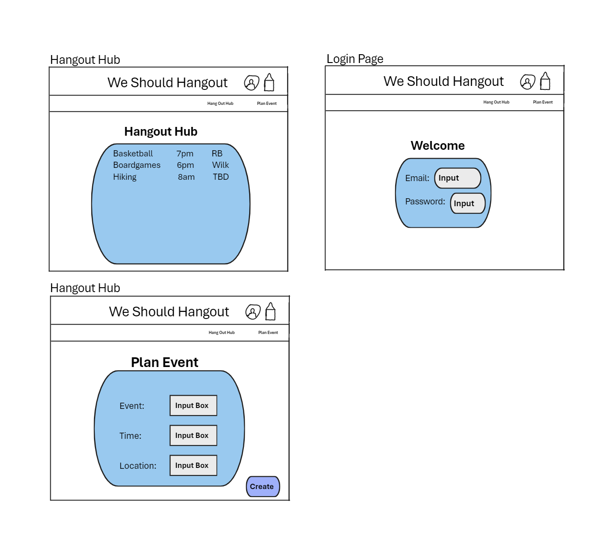

# We Should Hang Out

## Description Deliverable

### Elevator Pitch
We Should Hang Out will be an exclusive online platform crafted for college students, recognizing that even in a social environment, making friends can be challenging, especially for those who are shy or spend a lot of time focused on their studies. This platform will be designed to bridge that gap, connecting like-minded peers with shared interests. Whether you enjoy exploring new places, playing boardgames, staying active, or engaging in meaningful conversations.

### Design

The Photos above show a potential User Interface for the Login Page, the Hang Out Hub, and the create event page

### Key Features
+ Users will be able to create an account and log in
+ Users will be able to host an event
+ All users will be able to see all the events
+ If the date and time of an event pass then the event will automatically be removed from the database

### Technologies
I am going to use the required technology
+ HTML - I will use HTML to structure my application. There will be a login In Page, Create Event, See Events Page,
+ CSS - Design a neat structure that appeals users. 
+ JavaScript - Login, creating events, and seeing other events created
+ Service - Backend service with endpoints for 
    + login
    + seeing events
    + creating events 
+ DB/Login - Store users and events in database. Credentials securely stored in database.
+ WebSocket - If a user creates an event all users will be notified. 
+ React - Application ported to use the React web framework

### HTML Deliverable
For this deliverable I built out the structure of my application using HTML.

- **HTML pages** - A Variety of HTML pages with capabilites to view all events, one to plan an event, one to register, log in and log out. 
- **Links** - The navigation bar at the top allows the user to navigate to all the HTML pages.
- **Text** - Starting off at the welcome page there is text to introuduce the user to the website.
- **Images** - On each HTML page there is a logo on the top of each page.
- **DB/Login** - Input box and submit button for login. The plan event will push to the data base. The Hangout Hub will pull from the database.
- **WebSocket** - In the Hangout Hub, it will pull all the events created from other users. 

### CSS Deliverable
### JavaScript Deliverable
### Serivce Deiliverable
### DB/Login Deliverable
### WebSocket Deliverable
### React Deliverable
